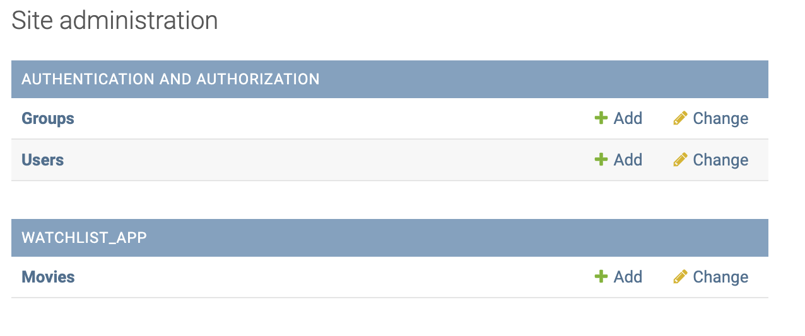

# Models and migrations

1. Add watchlist_app to `watchmate/settings.py` installed apps:
```python
INSTALLED_APPS = [
    'django.contrib.admin',
    'django.contrib.auth',
    'django.contrib.contenttypes',
    'django.contrib.sessions',
    'django.contrib.messages',
    'django.contrib.staticfiles',
    'watchlist_app,
]
```
2. run migrations
```
python manage.py migrate
```
3. create super user
```
python manage.py createsuperuser
```
- username: tomharper
- password: password
- go to admin panel: `http://127.0.0.1:8000/admin`
4. Create `urls.py` inside `watchlist_app`.
5. create model `Movie` in `models.py`
- make migrations and migrate
6. Register model in `watchlist_app/admin.py` as `admin.site.register(Movie)`
7. Check in django admin, you should see movies in watchlist_app:
